# ADR 002: Estratégia de Migração de Dados do Sistema Legado

**Status**: Aceito  
**Data**: 2024-02-01  
**Decisores**: Equipe de Desenvolvimento DTI + Secretaria de Saúde

## Contexto

O sistema legado (`pmpc_ciptea`) contém ~200 registros de beneficiários com dados criptografados (CPF, RG, CNS) usando AES-256-CBC. A migração para o novo sistema apresenta desafios:
- Chaves de criptografia podem estar incorretas ou perdidas
- Dados podem ter sido criptografados múltiplas vezes
- CPFs podem estar inválidos ou duplicados
- Necessidade de rastreabilidade e auditoria

## Decisão

Implementamos uma **estratégia de migração progressiva** com as seguintes características:

### 1. Preservação de Dados Originais
Criamos colunas `legacy_*` para backup dos dados criptografados:
- `legacy_cpf` - CPF criptografado original
- `legacy_rg` - RG criptografado original
- `legacy_cns` - CNS criptografado original

### 2. Tentativa de Descriptografia com Fallback
```
Tentar descriptografar → Sucesso? → Usar valor
                      → Falha? → NULL + Backup em legacy_*
```

### 3. Validação e Sanitização
- CPF: Validação de dígitos verificadores
- Nome: Conversão para Title Case
- Duplicatas: Verificação por `legado_id` e `cpf`

### 4. Processo de Revalidação
Interface administrativa permite:
- Comparação com dados legados
- Correção manual de dados
- Aprovação em lote

## Alternativas Consideradas

### 1. Migração "Tudo ou Nada"
**Descrição**: Só migrar registros com descriptografia bem-sucedida

**Prós:**
- Dados sempre válidos
- Sem campos NULL

**Contras:**
❌ Perda de dados históricos  
❌ Impossível recuperar registros posteriormente  
❌ Não atende requisito de preservação  

### 2. Placeholders para Dados Inválidos
**Descrição**: Usar valores como "000.000.000-00" para CPF inválido

**Prós:**
- Sem campos NULL
- Registros sempre completos

**Contras:**
❌ Dados falsos no sistema  
❌ Problemas com validação UNIQUE  
❌ Confusão para usuários  

### 3. Tabela Separada para Registros Problemáticos
**Descrição**: Migrar registros com problemas para tabela `beneficiarios_pendentes`

**Prós:**
- Separação clara
- Não polui tabela principal

**Contras:**
❌ Complexidade adicional  
❌ Dois fluxos de aprovação  
❌ Dificulta relatórios unificados  

## Decisão Escolhida: Migração com Backup

### Justificativa
✅ **Preservação Total**: Nenhum dado é perdido  
✅ **Rastreabilidade**: `legado_id` permite auditoria  
✅ **Flexibilidade**: Dados podem ser corrigidos posteriormente  
✅ **Transparência**: Administradores veem exatamente o que foi migrado  

## Consequências

### Positivas
✅ Zero perda de dados históricos  
✅ Possibilidade de melhorar descriptografia futuramente  
✅ Auditoria completa do processo  
✅ Interface de revalidação permite correções  

### Negativas
⚠️ Campos `cpf`, `rg`, `cns` podem ser NULL  
⚠️ Necessidade de validação extra em queries  
⚠️ Colunas `legacy_*` ocupam espaço adicional  

### Mitigações
- Validação de CPF obrigatória antes de aprovação
- Interface de revalidação facilita correção
- Colunas `legacy_*` podem ser removidas após auditoria

## Implementação

### Fluxo de Migração

```mermaid
flowchart TD
    A[Ler Registro Legado] --> B{Descriptografar CPF}
    B -->|Sucesso| C[cpf = valor]
    B -->|Falha| D[cpf = NULL<br/>legacy_cpf = original]
    C --> E{Validar CPF}
    D --> E
    E -->|Válido| F[Inserir Beneficiário]
    E -->|Inválido| G[Marcar para Revalidação]
    F --> H[Criar Solicitação]
    G --> H
```


### Código Exemplo
```php
// Tentar descriptografar
$decryptedCpf = $this->my_simple_crypt($row['CPF'], 'd');

if ($decryptedCpf && preg_match('/[0-9]{3}/', $decryptedCpf)) {
    $cpf = preg_replace('/[^0-9]/', '', $decryptedCpf);
} else {
    $cpf = null; // Falhou
}

// Sempre salvar backup
$legacyCpf = $row['CPF'];

// Inserir com ambos
$stmt->execute([
    ':cpf' => $cpf,
    ':legacy_cpf' => $legacyCpf,
    // ...
]);
```

## Métricas de Sucesso

| Métrica | Valor Esperado | Valor Real |
|---------|----------------|------------|
| Taxa de Descriptografia | 60-70% | ~65% |
| Registros Migrados | 100% | 100% |
| Duplicatas Evitadas | >95% | 98% |
| Revalidações Necessárias | <40% | 35% |

## Revisões Futuras

- **3 meses**: Avaliar se colunas `legacy_*` ainda são necessárias
- **6 meses**: Considerar remoção após auditoria completa
- **1 ano**: Documentar lições aprendidas para futuras migrações

## Referências

- [Fluxo de Migração](../architecture/migration_diagram.md)
- [ADR 003: Tratamento de Criptografia](003-encryption-handling.md)
- [Documentação do MigrationService](../api/spec.yaml#/components/schemas/ConfigMigracao)

