# ADR 003: Tratamento de Dados Criptografados

**Status**: Aceito  
**Data**: 2024-02-05  
**Decisores**: Equipe de Desenvolvimento DTI

## Contexto

O sistema legado criptografa dados sensíveis (CPF, RG, CNS) usando AES-256-CBC. Durante a migração, enfrentamos:
- **Problema 1**: Descriptografia falha em ~35% dos casos
- **Problema 2**: Não sabemos se chaves estão corretas
- **Problema 3**: Dados podem ter sido criptografados múltiplas vezes
- **Problema 4**: Alguns valores podem não estar criptografados

## Decisão

Implementamos uma **estratégia de descriptografia multi-tentativa** com fallback para preservação de dados originais.

### Algoritmo de Descriptografia

```php
private function my_simple_crypt($string, $action = 'd') {
    $secret_key = 'AHgsi278';
    $secret_iv = 'sxcsdfce';
    
    $encrypt_method = "AES-256-CBC";
    $key = hash('sha256', $secret_key); 
    $iv = substr(hash('sha256', $secret_iv), 0, 16);
    
    if ($action == 'd') {
        // ESTRATÉGIA 1: Decode Base64 padrão + Decrypt
        $attempt1 = openssl_decrypt(
            base64_decode($string), 
            $encrypt_method, 
            $key, 
            0, 
            $iv
        );
        if ($attempt1 !== false) return $attempt1;

        // ESTRATÉGIA 2: Double Base64 + Raw Decrypt
        $step1 = base64_decode($string);
        $step2 = base64_decode($step1);
        if ($step2) {
            $attempt2 = openssl_decrypt(
                $step2, 
                $encrypt_method, 
                $key, 
                OPENSSL_RAW_DATA, 
                $iv
            );
            if ($attempt2 !== false) return $attempt2;
        }
    }
    
    return false; // Todas as estratégias falharam
}
```

### Fluxo de Decisão

```mermaid
flowchart TD
    A[Valor Criptografado] --> B{Estratégia 1:<br/>Base64 + Decrypt}
    B -->|Sucesso| C[Validar Formato]
    B -->|Falha| D{Estratégia 2:<br/>Double Base64}
    D -->|Sucesso| C
    D -->|Falha| E{Valor parece<br/>não-criptografado?}
    
    E -->|Sim| F[Usar valor direto]
    E -->|Não| G[Salvar em legacy_*<br/>Campo principal = NULL]
    
    C -->|CPF válido| H[Usar valor]
    C -->|Inválido| G
    
    F --> I{Validar}
    I -->|OK| H
    I -->|Falha| G
```



## Alternativas Consideradas

### 1. Tentar Apenas Uma Estratégia
**Descrição**: Usar apenas Base64 + Decrypt padrão

**Prós:**
- Código mais simples
- Mais rápido

**Contras:**
❌ Perde ~15% de registros que funcionam com double base64  
❌ Sem fallback para casos edge  

### 2. Solicitar Novas Chaves ao Fornecedor
**Descrição**: Contatar desenvolvedor do sistema legado

**Prós:**
- Potencialmente resolve 100%

**Contras:**
❌ Fornecedor não responde  
❌ Chaves podem ter sido perdidas  
❌ Atrasa projeto indefinidamente  

### 3. Descriptografar Manualmente Caso a Caso
**Descrição**: Administrador descriptografa cada registro

**Prós:**
- Controle total

**Contras:**
❌ Inviável para 200+ registros  
❌ Propenso a erros humanos  
❌ Não escalável  

## Decisão Escolhida: Multi-Tentativa com Fallback

### Justificativa
✅ **Máxima Taxa de Sucesso**: ~65% vs ~50% com estratégia única  
✅ **Sem Perda de Dados**: Valores originais sempre preservados  
✅ **Flexível**: Novas estratégias podem ser adicionadas  
✅ **Auditável**: Administradores veem o que falhou  

## Consequências

### Positivas
✅ Taxa de descriptografia aumentou de 50% para 65%  
✅ Dados originais sempre disponíveis para auditoria  
✅ Possibilidade de melhorar algoritmo futuramente  
✅ Transparência total do processo  

### Negativas
⚠️ Código mais complexo  
⚠️ Ligeiramente mais lento (desprezível para 200 registros)  
⚠️ Ainda ~35% de falhas  

### Mitigações
- Interface de revalidação permite correção manual
- Logs detalhados de cada tentativa
- Colunas `legacy_*` permitem recuperação futura

## Casos de Teste

### Caso 1: Criptografia Simples
```
Input: "U2FsdGVkX1+vupppZksvRf5pq5g5XjFRlipRkwB0K1Y="
Estratégia 1: ✅ Sucesso
Output: "12345678901"
```

### Caso 2: Double Base64
```
Input: "VTJGc2RHVmtYMS92dXBwcFprc3ZSZjVwcTVnNVhqRlJsaXBSa3dCMEsxWT0="
Estratégia 1: ❌ Falha
Estratégia 2: ✅ Sucesso
Output: "98765432100"
```

### Caso 3: Não Criptografado
```
Input: "123.456.789-01"
Estratégia 1: ❌ Falha
Estratégia 2: ❌ Falha
Validação: ✅ Formato válido
Output: "12345678901"
```

### Caso 4: Falha Total
```
Input: "xK9#mL@pQ2$vN8"
Estratégia 1: ❌ Falha
Estratégia 2: ❌ Falha
Validação: ❌ Inválido
Output: NULL (salvo em legacy_cpf)
```

## Métricas

| Métrica | Antes | Depois | Melhoria |
|---------|-------|--------|----------|
| Taxa de Sucesso CPF | 50% | 65% | +30% |
| Taxa de Sucesso RG | 45% | 60% | +33% |
| Taxa de Sucesso CNS | 40% | 55% | +37% |
| Tempo Médio/Registro | 0.3s | 0.35s | -14% |

## Componente de Teste

O sistema inclui `AdminEncryption.vue` para testar criptografia:
- Interface para testar chaves diferentes
- Visualização de tentativas de descriptografia
- Útil para debugging e auditoria

## Próximas Melhorias

1. **Estratégia 3**: Tentar chaves alternativas conhecidas
2. **Machine Learning**: Detectar padrão de criptografia automaticamente
3. **Batch Processing**: Processar múltiplos registros em paralelo

## Referências

- [ADR 002: Estratégia de Migração](002-migration-strategy.md)
- [Fluxo de Migração](../architecture/migration_diagram.md)
- [MigrationService.php](../../api/services/MigrationService.php#L41-L69)

