# Schema do Banco de Dados - Portal de Inclusão

## Visão Geral

O banco de dados utiliza **MySQL 8.0** hospedado em **pocos-acolhedora-srv** com o nome `db_ciptea_girassol`. O schema foi projetado para suportar:
- Gestão de usuários e beneficiários
- Solicitações de carteiras CIPTEA/Girassol
- Upload e armazenamento de documentos
- Migração de dados do sistema legado
- Auditoria e rastreabilidade

## Diagrama Entidade-Relacionamento

```mermaid
erDiagram
    usuarios ||--o{ beneficiarios : "possui"
    beneficiarios ||--o{ solicitacoes : "solicita"
    solicitacoes ||--o{ documentos : "anexa"
    
    usuarios {
        int id PK
        string nome
        string email UK
        string senha_hash
        enum perfil
        timestamp criado_em
        timestamp atualizado_em
    }
    
    beneficiarios {
        int id PK
        int usuario_id FK
        string nome
        string nome_social
        string cpf UK
        string rg
        string orgao_emissor
        date data_nascimento
        enum sexo
        string naturalidade
        string tipo_sanguineo
        json deficiencias
        string cid
        string cns
        string filiacao_mae
        string filiacao_pai
        string responsavel_nome
        string responsavel_doc
        string responsavel_telefone
        string responsavel_email
        string rua
        string numero
        string bairro
        string cidade
        string estado
        string cep
        int legado_id
        string legacy_cpf
        string legacy_rg
        string legacy_cns
    }
    
    solicitacoes {
        int id PK
        int beneficiario_id FK
        enum tipo
        enum status
        text motivo_rejeicao
        string protocolo UK
        text observacoes_admin
        timestamp criado_em
        timestamp atualizado_em
        date data_renovacao
    }
    
    documentos {
        int id PK
        int solicitacao_id FK
        enum tipo
        string caminho_arquivo
        timestamp enviado_em
    }
```



## Tabelas Detalhadas

### 1. usuarios

Armazena credenciais e perfis de acesso ao sistema.

| Coluna | Tipo | Restrições | Descrição |
|--------|------|------------|-----------|
| `id` | INT | PK, AUTO_INCREMENT | Identificador único |
| `nome` | VARCHAR(255) | NOT NULL | Nome completo do usuário |
| `email` | VARCHAR(255) | NOT NULL, UNIQUE | Email para login |
| `senha_hash` | VARCHAR(255) | NOT NULL | Hash bcrypt da senha |
| `perfil` | ENUM | DEFAULT 'cidadao' | Perfil: 'cidadao' ou 'admin' |
| `criado_em` | TIMESTAMP | DEFAULT CURRENT_TIMESTAMP | Data de criação |
| `atualizado_em` | TIMESTAMP | ON UPDATE CURRENT_TIMESTAMP | Data da última atualização |

**Índices:**
- PRIMARY KEY (`id`)
- UNIQUE KEY (`email`)

---

### 2. beneficiarios

Armazena dados pessoais das pessoas com deficiência.

| Coluna | Tipo | Restrições | Descrição |
|--------|------|------------|-----------|
| `id` | INT | PK, AUTO_INCREMENT | Identificador único |
| `usuario_id` | INT | FK, NOT NULL | Referência ao usuário |
| `nome` | VARCHAR(255) | NOT NULL | Nome completo |
| `nome_social` | VARCHAR(255) | NULL | Nome social (opcional) |
| `cpf` | VARCHAR(14) | UNIQUE, NULL | CPF (pode ser NULL se migrado sem descriptografia) |
| `rg` | VARCHAR(20) | NULL | RG |
| `orgao_emissor` | VARCHAR(20) | NULL | Órgão emissor do RG |
| `data_nascimento` | DATE | NOT NULL | Data de nascimento |
| `sexo` | ENUM | NULL | 'Masculino', 'Feminino', 'Outro' |
| `naturalidade` | VARCHAR(100) | NULL | Cidade de nascimento |
| `tipo_sanguineo` | VARCHAR(5) | NULL | Tipo sanguíneo |
| `deficiencias` | JSON | NULL | Array de deficiências (ex: ["TEA", "TDAH"]) |
| `cid` | VARCHAR(10) | NULL | Código Internacional de Doenças |
| `cns` | VARCHAR(20) | NULL | Cartão Nacional de Saúde |
| `filiacao_mae` | VARCHAR(255) | NULL | Nome da mãe |
| `filiacao_pai` | VARCHAR(255) | NULL | Nome do pai |
| `responsavel_nome` | VARCHAR(255) | NULL | Nome do responsável legal |
| `responsavel_doc` | VARCHAR(50) | NULL | CPF/RG do responsável |
| `responsavel_telefone` | VARCHAR(20) | NULL | Telefone do responsável |
| `responsavel_email` | VARCHAR(255) | NULL | Email do responsável |
| `rua` | VARCHAR(255) | NULL | Endereço - Rua |
| `numero` | VARCHAR(20) | NULL | Endereço - Número |
| `bairro` | VARCHAR(100) | NULL | Endereço - Bairro |
| `cidade` | VARCHAR(100) | DEFAULT 'Poços de Caldas' | Cidade |
| `estado` | VARCHAR(2) | DEFAULT 'MG' | Estado (UF) |
| `cep` | VARCHAR(10) | NULL | CEP |
| `legado_id` | INT | NULL | ID do registro no sistema legado |
| `legacy_cpf` | TEXT | NULL | CPF criptografado original (backup) |
| `legacy_rg` | TEXT | NULL | RG criptografado original (backup) |
| `legacy_cns` | TEXT | NULL | CNS criptografado original (backup) |

**Índices:**
- PRIMARY KEY (`id`)
- UNIQUE KEY (`cpf`) - permite NULL
- FOREIGN KEY (`usuario_id`) REFERENCES `usuarios(id)` ON DELETE CASCADE
- INDEX (`legado_id`) - para buscas de migração

---

### 3. solicitacoes

Registra solicitações de carteiras CIPTEA/Girassol.

| Coluna | Tipo | Restrições | Descrição |
|--------|------|------------|-----------|
| `id` | INT | PK, AUTO_INCREMENT | Identificador único |
| `beneficiario_id` | INT | FK, NOT NULL | Referência ao beneficiário |
| `tipo` | ENUM | NOT NULL | 'ciptea', 'girassol', 'ambos' |
| `status` | ENUM | DEFAULT 'pendente' | 'pendente', 'aprovado', 'rejeitado' |
| `motivo_rejeicao` | TEXT | NULL | Justificativa em caso de rejeição |
| `protocolo` | VARCHAR(50) | UNIQUE | Número de protocolo para acompanhamento |
| `observacoes_admin` | TEXT | NULL | Observações internas do administrador |
| `criado_em` | TIMESTAMP | DEFAULT CURRENT_TIMESTAMP | Data de criação |
| `atualizado_em` | TIMESTAMP | ON UPDATE CURRENT_TIMESTAMP | Data da última atualização |
| `data_renovacao` | DATE | NULL | Data de renovação (migrado do legado) |

**Índices:**
- PRIMARY KEY (`id`)
- UNIQUE KEY (`protocolo`)
- FOREIGN KEY (`beneficiario_id`) REFERENCES `beneficiarios(id)` ON DELETE CASCADE
- INDEX (`status`) - para filtros

---

### 4. documentos

Armazena metadados dos documentos anexados às solicitações.

| Coluna | Tipo | Restrições | Descrição |
|--------|------|------------|-----------|
| `id` | INT | PK, AUTO_INCREMENT | Identificador único |
| `solicitacao_id` | INT | FK, NOT NULL | Referência à solicitação |
| `tipo` | ENUM | NOT NULL | Tipo do documento |
| `caminho_arquivo` | VARCHAR(255) | NOT NULL | Caminho do arquivo no storage |
| `enviado_em` | TIMESTAMP | DEFAULT CURRENT_TIMESTAMP | Data do upload |

**Tipos de Documento:**
- `foto_rosto` - Foto do rosto do beneficiário
- `doc_identidade` - RG ou CNH
- `doc_responsavel` - Documento do responsável legal
- `laudo_medico` - Laudo médico comprovando a deficiência
- `cartao_cns` - Cartão Nacional de Saúde
- `comprovante_residencia` - Comprovante de residência
- `assinatura` - Assinatura digitalizada

**Índices:**
- PRIMARY KEY (`id`)
- FOREIGN KEY (`solicitacao_id`) REFERENCES `solicitacoes(id)` ON DELETE CASCADE

---

## Estratégia de Migração de Dados

### Colunas Legadas

As colunas `legacy_*` em `beneficiarios` armazenam os valores criptografados originais do sistema legado:
- `legacy_cpf` - CPF criptografado (AES-256-CBC)
- `legacy_rg` - RG criptografado
- `legacy_cns` - CNS criptografado

### Processo de Migração

```mermaid
flowchart TD
    A[Início Migração] --> B{Conectar BD Legado}
    B -->|Sucesso| C[Ler Tabela 'Cadastro']
    B -->|Falha| Z[Erro: Conexão]
    
    C --> D[Para cada registro]
    D --> E{Tentar Descriptografar<br/>CPF, RG, CNS}
    
    E -->|Sucesso| F[Usar valor descriptografado]
    E -->|Falha| G[Manter NULL + Salvar em legacy_*]
    
    F --> H[Validar CPF]
    G --> H
    
    H -->|Válido| I[Criar Usuário]
    H -->|Inválido| J[Marcar para Revalidação]
    
    I --> K[Criar Beneficiário]
    J --> K
    
    K --> L[Criar Solicitação]
    L --> M[Migrar Documentos]
    M --> N{Mais registros?}
    
    N -->|Sim| D
    N -->|Não| O[Commit Transaction]
    O --> P[Fim]
```



### Tabelas Legado_*

Quando o banco de origem e destino são o mesmo, tabelas com prefixo `legado_` são tratadas como fonte:

```sql
-- Exemplo de tabela legada no mesmo banco
CREATE TABLE legado_cadastro (
    Id INT PRIMARY KEY,
    Nome VARCHAR(255),
    CPF TEXT, -- Criptografado
    RG TEXT,  -- Criptografado
    ...
);
```

## Estatísticas Atuais

| Tabela | Registros |
|--------|-----------|
| usuarios | 6 |
| beneficiarios | 5 |
| solicitacoes | 5 |
| documentos | 43 |

## Consultas Úteis

### Listar solicitações pendentes
```sql
SELECT 
    s.id,
    s.protocolo,
    b.nome,
    b.cpf,
    s.tipo,
    s.criado_em
FROM solicitacoes s
JOIN beneficiarios b ON s.beneficiario_id = b.id
WHERE s.status = 'pendente'
ORDER BY s.criado_em DESC;
```

### Verificar registros migrados
```sql
SELECT 
    COUNT(*) as total_migrados,
    SUM(CASE WHEN cpf IS NOT NULL THEN 1 ELSE 0 END) as com_cpf_valido,
    SUM(CASE WHEN legacy_cpf IS NOT NULL THEN 1 ELSE 0 END) as com_backup_legado
FROM beneficiarios
WHERE legado_id IS NOT NULL;
```

### Auditoria de documentos por solicitação
```sql
SELECT 
    s.protocolo,
    b.nome,
    COUNT(d.id) as total_documentos,
    GROUP_CONCAT(d.tipo) as tipos_enviados
FROM solicitacoes s
JOIN beneficiarios b ON s.beneficiario_id = b.id
LEFT JOIN documentos d ON d.solicitacao_id = s.id
GROUP BY s.id;
```

## Manutenção e Backup

### Backup Diário
```bash
mysqldump -h pocos-acolhedora-srv -u ciptea_girassol_dti -p db_ciptea_girassol > backup_$(date +%Y%m%d).sql
```

### Restauração
```bash
mysql -h pocos-acolhedora-srv -u ciptea_girassol_dti -p db_ciptea_girassol < backup_20260209.sql
```

## Referências

- [Visão Geral da Arquitetura](overview.md)
- [Fluxo de Migração](migration_diagram.md)
- [ADR: Estratégia de Migração](../adr/002-migration-strategy.md)

