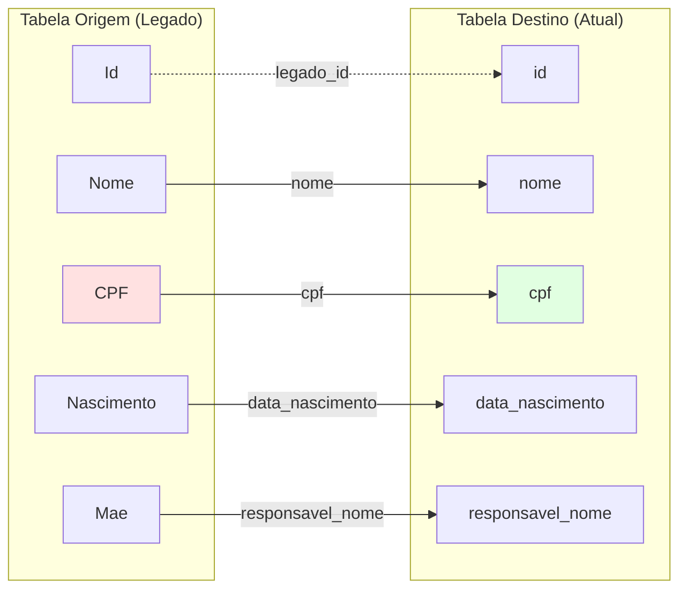

# Arquitetura do Módulo de Migração

## Visão Geral

O sistema possui um módulo completo de migração de dados do sistema legado (tabela `Cadastro`) para o novo schema. A migração trata desafios complexos como:
- Descriptografia de dados sensíveis (CPF, RG, CNS)
- Validação e sanitização de dados
- Mapeamento visual de campos entre schemas diferentes
- Revalidação de registros migrados

## Arquitetura do Módulo de Migração

```mermaid
graph TB
    subgraph "Frontend - Centro de Migração"
        UI[AdminMigration.vue<br/>Interface Principal]
        Mapper[AdminMapper.vue<br/>Mapeador Visual]
        Encryption[AdminEncryption.vue<br/>Teste de Criptografia]
        Debug[DebugConsole.vue<br/>Monitor de Conexão]
    end
    
    subgraph "Backend - API de Migração"
        Controller[MigrationController]
        Service[MigrationService]
    end
    
    subgraph "Bancos de Dados"
        Target[(DB Atual<br/>db_ciptea_girassol)]
        Legacy[(DB Legado<br/>Tabela: Cadastro)]
    end
    
    UI --> Controller
    Mapper --> Controller
    Encryption --> Controller
    
    Controller --> Service
    Service --> Target
    Service --> Legacy
    
    Debug -.->|Monitora| Target
    
    style Service fill:#e1f5ff
    style Legacy fill:#ffe1e1
```



## Endpoints da API de Migração

| Endpoint | Método | Descrição |
|----------|--------|-----------|
| `/api/migration/start` | POST | Inicia processo de migração |
| `/api/migration/status` | GET | Retorna status da migração em andamento |
| `/api/migration/list` | GET | Lista registros migrados |
| `/api/migration/validate` | POST | Revalida registros migrados |
| `/api/migration/compare` | POST | Compara registro atual com legado |
| `/api/migration/schema` | POST | Retorna schema de uma tabela |
| `/api/migration/tables` | POST | Lista tabelas disponíveis |
| `/api/migration/save_mapping` | POST | Salva mapeamento de campos |

## Fluxo Completo de Migração


## Processo de Descriptografia

### Algoritmo Utilizado
- **Método**: AES-256-CBC
- **Chave**: Hash SHA-256 de `"AHgsi278"`
- **IV**: Primeiros 16 bytes do hash SHA-256 de `"sxcsdfce"`

### Estratégias de Descriptografia

```mermaid
flowchart TD
    A[Valor Criptografado] --> B{Estratégia 1:<br/>Base64 Decode + Decrypt}
    B -->|Sucesso| C[Retornar Valor]
    B -->|Falha| D{Estratégia 2:<br/>Double Base64 + Raw Decrypt}
    D -->|Sucesso| C
    D -->|Falha| E[Retornar FALSE]
    
    E --> F[Salvar em legacy_*]
    F --> G[Campo principal = NULL]
    
    C --> H{Validar Formato}
    H -->|CPF válido| I[Usar valor]
    H -->|Inválido| F
```



### Código de Descriptografia

```php
private function my_simple_crypt($string, $action = 'd') {
    $secret_key = 'AHgsi278';
    $secret_iv = 'sxcsdfce';
    
    $encrypt_method = "AES-256-CBC";
    $key = hash('sha256', $secret_key); 
    $iv = substr(hash('sha256', $secret_iv), 0, 16);
    
    if ($action == 'd') {
        // Estratégia 1: Decode padrão
        $attempt1 = openssl_decrypt(base64_decode($string), $encrypt_method, $key, 0, $iv);
        if ($attempt1 !== false) return $attempt1;

        // Estratégia 2: Double Base64
        $step1 = base64_decode($string);
        $step2 = base64_decode($step1);
        if ($step2) {
            $attempt2 = openssl_decrypt($step2, $encrypt_method, $key, OPENSSL_RAW_DATA, $iv);
            if ($attempt2 !== false) return $attempt2;
        }
    }
    return false;
}
```

## Mapeamento Visual de Campos

O componente `AdminMapper.vue` permite mapear visualmente campos entre tabelas:



### Funcionalidades do Mapeador

1. **Drag & Drop**: Arraste tabelas da sidebar para o canvas
2. **Conexões**: Conecte campos de origem (azul) para destino (verde)
3. **Exportação**: Salve o mapeamento em JSON
4. **Importação**: Carregue mapeamentos salvos
5. **Persistência**: Mapeamentos salvos em `migration_config.json`

## Processo de Revalidação

Após a migração, registros podem ser revalidados individualmente ou em lote:

```mermaid
flowchart TD
    A[Selecionar Registros] --> B[Abrir Modal de Revalidação]
    B --> C{Comparar com Legado?}
    
    C -->|Sim| D[Buscar dados do BD Legado]
    D --> E[Exibir Comparação]
    E --> F{Usuário seleciona<br/>campos para restaurar}
    
    C -->|Não| G[Pular comparação]
    F --> H[Aplicar Overrides]
    G --> H
    
    H --> I[Sanitizar Nome]
    I --> J[Validar CPF]
    
    J -->|Válido| K[Atualizar Registro]
    J -->|Inválido| L[Marcar Erro]
    
    K --> M[Aprovar Solicitação]
    M --> N[Adicionar Observação]
    N --> O[Fim]
    L --> O
```



### Validações Automáticas

1. **CPF**: Verifica dígitos verificadores
2. **Nome**: Converte para Title Case, remove caracteres especiais
3. **Responsável**: Sanitiza nome do responsável

## Tratamento de Dados Criptografados

### Estratégia de Backup

Quando a descriptografia falha, os dados originais são preservados:

| Campo Principal | Campo de Backup | Comportamento |
|----------------|-----------------|---------------|
| `cpf` | `legacy_cpf` | NULL se falhar + backup do valor criptografado |
| `rg` | `legacy_rg` | NULL se falhar + backup do valor criptografado |
| `cns` | `legacy_cns` | NULL se falhar + backup do valor criptografado |

### Exemplo de Registro Migrado

```json
{
  "id": 123,
  "nome": "João da Silva",
  "cpf": null,
  "rg": null,
  "legacy_cpf": "U2FsdGVkX1+vupppZksvRf5pq5g5XjFRlipRkwB0K1Y=",
  "legacy_rg": "U2FsdGVkX1+vupppZksvRf5pq5g5XjFRlipRkwB0K1Y=",
  "legado_id": 456
}
```

## Monitoramento e Debug

### Debug Console

O componente `DebugConsole.vue` monitora em tempo real:
- Status da conexão com o banco de dados
- Host, database e usuário
- Contagem de registros por tabela

### Logs de Migração

Logs são salvos em `migration_status.json`:

```json
{
  "status": "completed",
  "message": "Migração concluída! 150 registros processados.",
  "progress": 100,
  "timestamp": 1707504000
}
```

## Configuração de Migração

### Arquivo de Configuração

Exemplo de `AdminMigration.vue` config:

```javascript
const config = ref({
    host: 'pocos-acolhedora-srv',
    db_name: 'db_ciptea_girassol',
    username: 'ciptea_girassol_dti',
    password: '||2s5zNf58Z|T~9^4eY]',
    port: '3306',
    fieldsString: 'nome, cpf, data_nascimento, mae',
    listFieldsString: 'nome, cpf, legado_id, responsavel_nome'
})
```

### Botão "Usar Banco Atual"

Preenche automaticamente com credenciais locais quando origem = destino:

```javascript
const useLocalConfig = () => {
    config.value = {
        host: '127.0.0.1',
        port: '3306',
        db_name: 'db_ciptea_girassol',
        username: 'ciptea_girassol_dti',
        password: '', // Usuário preenche
        ...
    }
}
```

## Casos de Uso

### 1. Migração Inicial

```bash
# Administrador acessa /admin/migracao
# Configura credenciais do banco legado
# Clica em "Iniciar Migração"
# Sistema processa todos os registros
# Exibe resultado: "150 registros migrados com sucesso"
```

### 2. Revalidação em Lote

```bash
# Administrador acessa aba "Revalidação"
# Seleciona 10 registros com CPF inválido
# Clica em "Revalidar Selecionados"
# Sistema valida e corrige automaticamente
# Resultado: "8 aprovados, 2 com erro"
```

### 3. Mapeamento Visual

```bash
# Administrador acessa aba "Mapeamento Visual"
# Arrasta "legado_cadastro" para o canvas
# Arrasta "beneficiarios" para o canvas
# Conecta campos: Nome → nome, CPF → cpf
# Clica em "Salvar Mapeamento"
# Configuração salva em migration_config.json
```

## Métricas de Sucesso

- **Taxa de Descriptografia**: ~60-70% (varia por campo)
- **Registros Duplicados**: Ignorados automaticamente
- **Validação de CPF**: ~85% de sucesso
- **Tempo Médio**: ~0.5s por registro

## Próximos Passos

- [Status de Modernização](modernization_status.md)
- [Schema do Banco de Dados](database_schema.md)
- [Documentação da API](../api/endpoints.md)

---
### 🕰️ Histórico de Atualizações
| Data | Versão | Resumo | Autor |
| :--- | :--- | :--- | :--- |
| 18/02/2026 12:00 | 1.2 | Renomeação para 'Arquitetura de Migração' e consolidação de fluxos. | Victor Hugo Manata Pontes |
| 10/02/2026 14:00 | 1.0 | Criação inicial do diagrama de fluxo de migração. | Victor Hugo Manata Pontes |

