# Visão Geral da Arquitetura - Portal de Inclusão

## Introdução

O **Portal de Inclusão** é um sistema web para gestão de solicitações de carteiras de identificação (CIPTEA e Girassol) para pessoas com deficiência no município de Poços de Caldas/MG. O sistema inclui funcionalidades avançadas de migração de dados de sistemas legados.

## Diagrama C4 - Nível 1: Contexto do Sistema

```mermaid
C4Context
    title Diagrama de Contexto - Portal de Inclusão
    
    Person(cidadao, "Cidadão", "Pessoa com deficiência ou responsável legal")
    Person(admin, "Administrador", "Servidor municipal da Secretaria de Saúde")
    
    System(portal, "Portal de Inclusão", "Sistema web para solicitação e gestão de carteiras CIPTEA/Girassol")
    
    System_Ext(legado, "Sistema Legado", "Banco de dados do sistema anterior (Cadastro)")
    System_Ext(n8n, "n8n Workflow", "Automação de processos e integrações")
    System_Ext(email, "Servidor de Email", "Envio de notificações")
    
    Rel(cidadao, portal, "Solicita carteira, acompanha status", "HTTPS")
    Rel(admin, portal, "Gerencia solicitações, aprova/rejeita", "HTTPS")
    Rel(portal, legado, "Migra dados históricos", "MySQL/TCP")
    Rel(portal, n8n, "Dispara workflows", "HTTP/Webhook")
    Rel(portal, email, "Envia notificações", "SMTP")
```

## Diagrama C4 - Nível 2: Contêineres

```mermaid
C4Container
    title Diagrama de Contêineres - Portal de Inclusão
    
    Person(user, "Usuário", "Cidadão ou Administrador")
    
    Container_Boundary(portal, "Portal de Inclusão") {
        Container(spa, "Frontend SPA", "Vue.js 3, Vite", "Interface web responsiva com componentes reativos")
        Container(api, "Backend API", "PHP 8+, PDO", "API REST para lógica de negócio e acesso a dados")
        ContainerDb(db, "Banco de Dados", "MySQL 8.0", "Armazena usuários, beneficiários, solicitações e documentos")
    }
    
    System_Ext(legado_db, "Banco Legado", "MySQL - Sistema anterior")
    System_Ext(storage, "File Storage", "Sistema de arquivos local")
    
    Rel(user, spa, "Acessa via navegador", "HTTPS")
    Rel(spa, api, "Faz requisições", "JSON/REST")
    Rel(api, db, "Lê/Escreve dados", "PDO/MySQL")
    Rel(api, legado_db, "Migra dados históricos", "PDO/MySQL")
    Rel(api, storage, "Armazena uploads", "File System")
```

## Diagrama de Componentes - Backend API

```mermaid
graph TB
    subgraph "Backend API (PHP)"
        Router[index.php<br/>Router] --> Controllers{Controllers}
        
        Controllers --> AuthCtrl[AuthController<br/>Login/Autenticação]
        Controllers --> ReqCtrl[RequestController<br/>Solicitações CRUD]
        Controllers --> MigCtrl[MigrationController<br/>Migração de Dados]
        Controllers --> DashCtrl[DashboardController<br/>Estatísticas]
        Controllers --> RepCtrl[ReportController<br/>Relatórios]
        Controllers --> SecCtrl[SecurityController<br/>Criptografia]
        
        MigCtrl --> MigSvc[MigrationService<br/>Lógica de Migração]
        
        AuthCtrl --> DB[(Database)]
        ReqCtrl --> DB
        MigCtrl --> DB
        DashCtrl --> DB
        RepCtrl --> DB
        
        MigSvc --> LegacyDB[(Banco Legado)]
        MigSvc --> DB
    end
    
    SPA[Frontend Vue.js] -->|JSON/REST| Router
    
    style MigCtrl fill:#e1f5ff
    style MigSvc fill:#e1f5ff
    style LegacyDB fill:#ffe1e1
```

## Diagrama de Componentes - Frontend SPA

```mermaid
graph TB
    subgraph "Frontend Vue.js"
        Router[Vue Router] --> Views{Views}
        
        Views --> Home[Home.vue<br/>Página Inicial]
        Views --> Login[AdminLogin.vue<br/>Login Admin]
        Views --> Dashboard[AdminDashboard.vue<br/>Painel Admin]
        Views --> Migration[AdminMigration.vue<br/>Centro de Migração]
        Views --> Mapper[AdminMapper.vue<br/>Mapeador Visual]
        Views --> ReqDetails[AdminRequestDetails.vue<br/>Detalhes Solicitação]
        
        Migration --> DebugConsole[DebugConsole.vue<br/>Console de Debug]
        Migration --> BaseModal[BaseModal.vue<br/>Modal Reutilizável]
        Migration --> Encryption[AdminEncryption.vue<br/>Teste Criptografia]
        
        Mapper --> TableNode[TableNode.vue<br/>Nó de Tabela]
        Mapper --> VueFlow[VueFlow Library<br/>Drag & Drop]
    end
    
    API[Backend API] -->|JSON| Router
    
    style Migration fill:#fff4e1
    style Mapper fill:#e1ffe1
```

## Tecnologias Utilizadas

### Frontend
| Tecnologia | Versão | Propósito |
|------------|--------|-----------|
| Vue.js | 3.x | Framework progressivo para UI reativa |
| Vite | 5.x | Build tool e dev server rápido |
| Vue Router | 4.x | Roteamento SPA |
| TailwindCSS | 3.x | Framework CSS utilitário |
| @vue-flow/core | Latest | Biblioteca para diagramas interativos |

### Backend
| Tecnologia | Versão | Propósito |
|------------|--------|-----------|
| PHP | 8.0+ | Linguagem server-side |
| PDO | Nativo | Abstração de banco de dados |
| OpenSSL | Nativo | Criptografia AES-256-CBC |

### Banco de Dados
| Tecnologia | Versão | Propósito |
|------------|--------|-----------|
| MySQL | 8.0 | Banco de dados relacional |
| Host | pocos-acolhedora-srv | Servidor de produção |

### Infraestrutura
| Componente | Tecnologia | Propósito |
|------------|------------|-----------|
| Web Server | PHP Built-in | Desenvolvimento (porta 8000) |
| Frontend Server | Vite Dev | Desenvolvimento (porta 5173) |
| Debug Console | DebugConsole.vue | Monitoramento de conexão DB |

## Fluxo de Dados Principal

```mermaid
sequenceDiagram
    participant U as Usuário
    participant F as Frontend (Vue)
    participant A as API (PHP)
    participant D as Database (MySQL)
    
    U->>F: Acessa aplicação
    F->>A: GET /api/status
    A->>D: Verifica conexão
    D-->>A: Status OK
    A-->>F: {status: "ok"}
    F-->>U: Exibe interface
    
    U->>F: Submete solicitação
    F->>A: POST /api/solicitacoes
    A->>D: INSERT INTO solicitacoes
    A->>D: INSERT INTO documentos
    D-->>A: IDs criados
    A-->>F: {success: true, protocolo: "..."}
    F-->>U: Confirmação + Protocolo
```

## Padrões Arquiteturais

### Backend
- **PSR-4 Autoloading**: Carregamento automático de classes via namespaces (`App\`).
- **Repository Pattern**: Isolamento total do SQL, facilitando a testabilidade e troca de banco.
- **Service Layer**: Centralização da lógica de negócio (ex: `RequestService`, `DashboardService`).
- **Middleware System**: Interceptação de rotas para segurança e validação (JWT).
- **JWT Authentication**: Sistema de tokens HS256 real para proteção de áreas administrativas.
- **MVC Simplificado**: Estrutura organizada para escalabilidade.

### Frontend
- **Component-Based**: Componentes Vue reutilizáveis
- **Single Page Application**: Navegação sem reload
- **Reactive State**: Refs e computed properties
- **Composition API**: Setup script para lógica de componentes

## Segurança

### Autenticação
- Login via email/senha
- Senha hash com `password_hash()` (bcrypt)
- Token armazenado em `localStorage`
- Guard de navegação para rotas protegidas

### Autorização
- Perfis: `cidadao` e `admin`
- Rotas administrativas protegidas por `meta.requiresAuth`
- Verificação de perfil no backend

### Criptografia
- **Algoritmo**: AES-256-CBC
- **Uso**: Dados sensíveis do sistema legado (CPF, RG, CNS)
- **Chaves**: Definidas em `SecurityController` e `MigrationService`

## Próximos Passos

Consulte a documentação específica:
- [Arquitetura de Migração](migration_architecture.md)
- [Status de Modernização](modernization_status.md)
- [Schema do Banco de Dados](database_schema.md)
- [Especificação da API](../api/spec.yaml)

---
### 🕰️ Histórico de Atualizações
| Data | Versão | Resumo | Autor |
| :--- | :--- | :--- | :--- |
| 18/02/2026 11:15 | 1.2 | Revisão da arquitetura após migração para Composer e limpeza técnica. | Victor Hugo Manata Pontes |
| 18/02/2026 09:00 | 1.1 | Melhorias de performance: Caching e Indexação SQL. | Victor Hugo Manata Pontes |
| 14/02/2026 16:00 | 0.8 | Padronização de Modais e Componentes UI. | Victor Hugo Manata Pontes |
| 09/02/2026 10:00 | 0.6 | Dashboard BI e Módulo de Geoprocessamento. | Victor Hugo Manata Pontes |
| 08/02/2026 09:00 | 0.5 | Landing Page e Wizard de Cadastro. | Victor Hugo Manata Pontes |
| 01/02/2026 14:00 | 0.1 | Definição inicial da arquitetura de containers. | Victor Hugo Manata Pontes |

