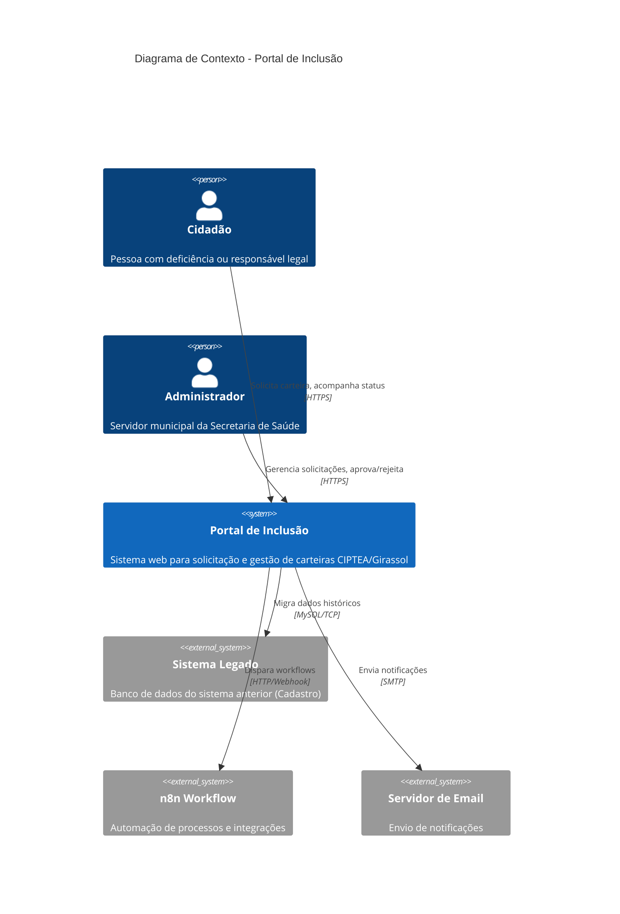
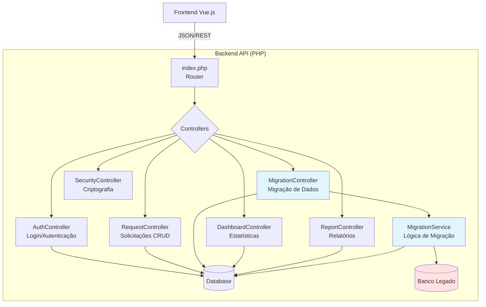
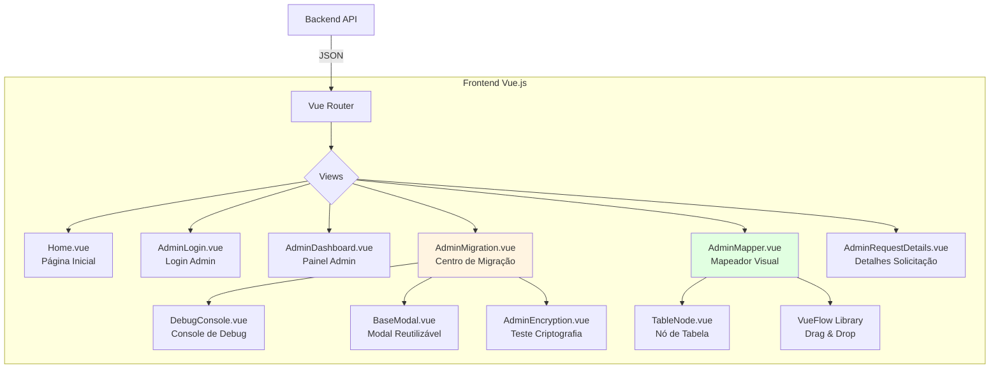
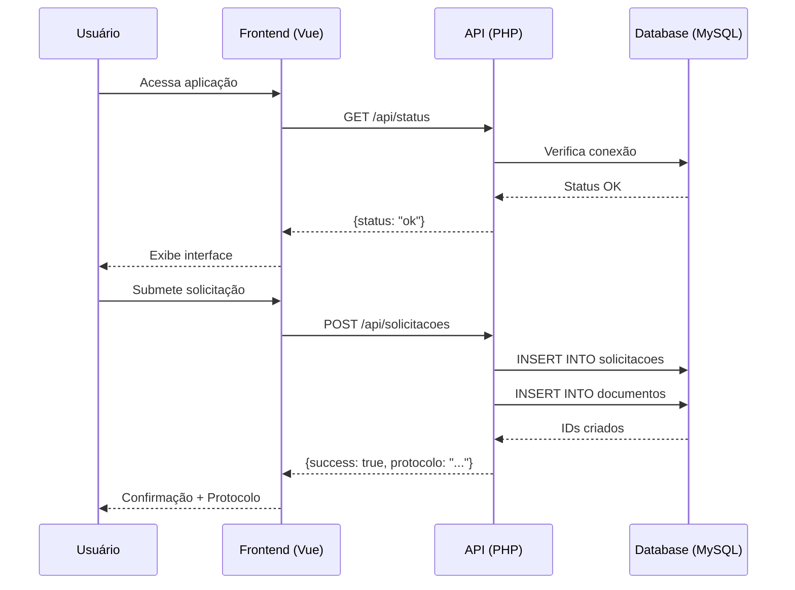

# Visão Geral da Arquitetura - Portal de Inclusão

## Introdução

O **Portal de Inclusão** é um sistema web para gestão de solicitações de carteiras de identificação (CIPTEA e Girassol) para pessoas com deficiência no município de Poços de Caldas/MG. O sistema inclui funcionalidades avançadas de migração de dados de sistemas legados.

## Diagrama C4 - Nível 1: Contexto do Sistema

## Diagrama C4 - Nível 2: Contêineres

## Diagrama de Componentes - Backend API

## Diagrama de Componentes - Frontend SPA

## Tecnologias Utilizadas

### Frontend
| Tecnologia | Versão | Propósito |
|------------|--------|-----------|
| Vue.js | 3.x | Framework progressivo para UI reativa |
| Vite | 5.x | Build tool e dev server rápido |
| Vue Router | 4.x | Roteamento SPA |
| TailwindCSS | 3.x | Framework CSS utilitário |
| @vue-flow/core | Latest | Biblioteca para diagramas interativos |

### Backend
| Tecnologia | Versão | Propósito |
|------------|--------|-----------|
| PHP | 8.0+ | Linguagem server-side |
| PDO | Nativo | Abstração de banco de dados |
| OpenSSL | Nativo | Criptografia AES-256-CBC |

### Banco de Dados
| Tecnologia | Versão | Propósito |
|------------|--------|-----------|
| MySQL | 8.0 | Banco de dados relacional |
| Host | pocos-acolhedora-srv | Servidor de produção |

### Infraestrutura
| Componente | Tecnologia | Propósito |
|------------|------------|-----------|
| Web Server | PHP Built-in | Desenvolvimento (porta 8000) |
| Frontend Server | Vite Dev | Desenvolvimento (porta 5173) |
| Debug Console | DebugConsole.vue | Monitoramento de conexão DB |

## Fluxo de Dados Principal

## Padrões Arquiteturais

### Backend
- **PSR-4 Autoloading**: Carregamento automático de classes via namespaces (`App\`).
- **Repository Pattern**: Isolamento total do SQL, facilitando a testabilidade e troca de banco.
- **Service Layer**: Centralização da lógica de negócio (ex: `RequestService`, `DashboardService`).
- **Middleware System**: Interceptação de rotas para segurança e validação (JWT).
- **JWT Authentication**: Sistema de tokens HS256 real para proteção de áreas administrativas.
- **MVC Simplificado**: Estrutura organizada para escalabilidade.

### Frontend
- **Component-Based**: Componentes Vue reutilizáveis
- **Single Page Application**: Navegação sem reload
- **Reactive State**: Refs e computed properties
- **Composition API**: Setup script para lógica de componentes

## Segurança

### Autenticação
- Login via email/senha
- Senha hash com `password_hash()` (bcrypt)
- Token armazenado em `localStorage`
- Guard de navegação para rotas protegidas

### Autorização
- Perfis: `cidadao` e `admin`
- Rotas administrativas protegidas por `meta.requiresAuth`
- Verificação de perfil no backend

### Criptografia
- **Algoritmo**: AES-256-CBC
- **Uso**: Dados sensíveis do sistema legado (CPF, RG, CNS)
- **Chaves**: Definidas em `SecurityController` e `MigrationService`

## Próximos Passos

Consulte a documentação específica:
- [Arquitetura de Migração](migration_architecture.md)
- [Status de Modernização](modernization_status.md)
- [Schema do Banco de Dados](database_schema.md)
- [Especificação da API](../api/spec.yaml)

---
### 🕰️ Histórico de Atualizações
| Data | Versão | Resumo | Autor |
| :--- | :--- | :--- | :--- |
| 18/02/2026 11:15 | 1.2 | Revisão da arquitetura após migração para Composer e limpeza técnica. | Victor Hugo Manata Pontes |
| 18/02/2026 09:00 | 1.1 | Melhorias de performance: Caching e Indexação SQL. | Victor Hugo Manata Pontes |
| 14/02/2026 16:00 | 0.8 | Padronização de Modais e Componentes UI. | Victor Hugo Manata Pontes |
| 09/02/2026 10:00 | 0.6 | Dashboard BI e Módulo de Geoprocessamento. | Victor Hugo Manata Pontes |
| 08/02/2026 09:00 | 0.5 | Landing Page e Wizard de Cadastro. | Victor Hugo Manata Pontes |
| 01/02/2026 14:00 | 0.1 | Definição inicial da arquitetura de containers. | Victor Hugo Manata Pontes |
