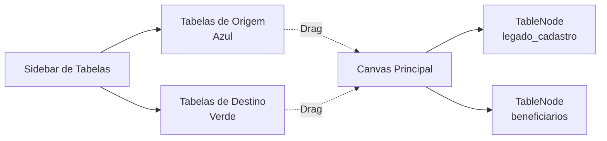
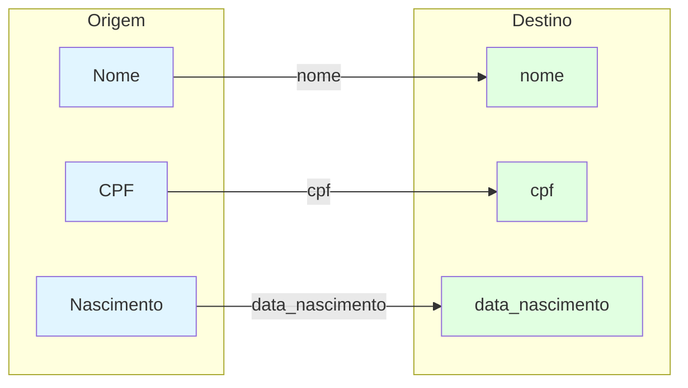

# Mapeador Visual de Dados - AdminMapper.vue

## Visão Geral

O **Mapeador Visual** é uma ferramenta interativa que permite criar mapeamentos entre tabelas de bancos de dados diferentes através de uma interface drag-and-drop. É especialmente útil para configurar migrações de dados complexas.

## Funcionalidades

### 1. Visualização de Tabelas



**Características:**
- **Sidebar**: Lista todas as tabelas disponíveis (Auto-filtragem de prefixos)
- **Origem (Azul)**: Exibe **apenas** tabelas iniciadas com `legado_` para facilitar a identificação.
- **Destino (Verde)**: Tabelas do banco atual
- **Canvas**: Área de trabalho com zoom e pan

### 2. Drag & Drop de Tabelas

**Como usar:**
1. Arraste uma tabela da sidebar para o canvas
2. O sistema busca automaticamente o schema da tabela
3. A tabela aparece como um nó com todos os campos listados

**Exemplo de Nó:**
```
┌─────────────────────────┐
│ legado_cadastro         │
├─────────────────────────┤
│ ○ Id (int)              │
│ ○ Nome (varchar)        │
│ ○ CPF (text)            │
│ ○ Nascimento (date)     │
│ ○ Mae (varchar)         │
└─────────────────────────┘
```

### 3. Criação de Conexões

**Conectar Campos:**
1. Clique no círculo de um campo de origem (azul)
2. Arraste até o círculo de um campo de destino (verde)
3. Uma linha conecta os dois campos

**Exemplo de Mapeamento:**


### 4. Exportação e Importação

#### Exportar JSON
Salva o mapeamento completo incluindo:
- Posições dos nós no canvas
- Todas as conexões entre campos
- Metadados (data, versão)

**Formato do Arquivo:**
```json
{
  "metadata": {
    "date": "2026-02-09T19:30:00.000Z",
    "version": "1.0"
  },
  "nodes": [
    {
      "id": "source-legado_cadastro-1707504000",
      "type": "table-node",
      "position": { "x": 100, "y": 100 },
      "data": {
        "label": "legado_cadastro",
        "columns": [
          { "name": "Id", "type": "int(11)" },
          { "name": "Nome", "type": "varchar(255)" }
        ],
        "type": "source"
      }
    }
  ],
  "edges": [
    {
      "id": "edge-1",
      "source": "source-legado_cadastro-1707504000",
      "target": "target-beneficiarios-1707504010",
      "sourceHandle": "src-legado_cadastro-Nome",
      "targetHandle": "tgt-beneficiarios-nome"
    }
  ],
  "mapping": [
    {
      "source": { "table": "legado_cadastro", "field": "Nome" },
      "target": { "table": "beneficiarios", "field": "nome" }
    }
  ]
}
```

#### Importar JSON
Restaura um mapeamento salvo anteriormente, recriando:
- Todos os nós nas posições originais
- Todas as conexões entre campos

### 5. Salvar Mapeamento

O botão **"Salvar Mapeamento"** persiste a configuração no backend:
- Arquivo: `migration_config.json`
- Formato: Estrutura de mapeamento por par de tabelas
- Uso: Aplicado automaticamente em migrações futuras

## Interface do Usuário

### Layout

```
┌────────────────────────────────────────────────────────┐
│ Mapeamento Visual                                      │
├──────────┬─────────────────────────────────────────────┤
│          │                                             │
│ Tabelas  │          Canvas Principal                   │
│          │                                             │
│ ┌──────┐ │  ┌──────────┐         ┌──────────┐         │
│ │Origem│ │  │ Tabela 1 │────────▶│ Tabela 2 │         │
│ ├──────┤ │  └──────────┘         └──────────┘         │
│ │ T1   │ │                                             │
│ │ T2   │ │                                             │
│ │ T3   │ │                                             │
│ └──────┘ │                                             │
│          │                                             │
│ ┌──────┐ │                                             │
│ │Dest. │ │                                             │
│ ├──────┤ │                                             │
│ │ T4   │ │  [Salvar] [Exportar] [Importar]            │
│ │ T5   │ │                                             │
│ └──────┘ │                                             │
└──────────┴─────────────────────────────────────────────┘
```

### Controles

| Botão | Ação |
|-------|------|
| **Salvar Mapeamento** | Persiste configuração no backend |
| **Exportar JSON** | Download do arquivo de configuração |
| **Importar JSON** | Upload de configuração salva |
| **Zoom +/-** | Controles de zoom do VueFlow |
| **Fit View** | Ajusta visualização para mostrar todos os nós |

## Tecnologias Utilizadas

- **@vue-flow/core**: Biblioteca para diagramas interativos
- **@vue-flow/background**: Grid de fundo
- **@vue-flow/controls**: Controles de zoom e navegação
- **Fetch API**: Comunicação com backend

## Casos de Uso

### Caso 1: Migração Simples

```
Objetivo: Migrar tabela legado_cadastro → beneficiarios

Passos:
1. Arrastar "legado_cadastro" para o canvas
2. Arrastar "beneficiarios" para o canvas
3. Conectar campos:
   - Id → legado_id
   - Nome → nome
   - CPF → cpf
   - Nascimento → data_nascimento
4. Clicar em "Salvar Mapeamento"
5. Configuração aplicada automaticamente em migrações
```

### Caso 2: Mapeamento Complexo

```
Objetivo: Mapear múltiplas tabelas com transformações

Passos:
1. Adicionar tabelas de origem: legado_cadastro, legado_arquivos
2. Adicionar tabelas de destino: beneficiarios, documentos
3. Criar conexões entre campos relacionados
4. Exportar JSON para backup
5. Salvar mapeamento no sistema
```

## Integração com Migração

O mapeamento salvo é utilizado automaticamente pelo `MigrationService`:

```php
// Backend: MigrationService.php
$legacyMap = [
    'nome' => 'Nome',
    'cpf' => 'CPF',
    // ...
];

// Merge com mapeamento customizado
if (!empty($config['field_map'])) {
    $legacyMap = array_merge($legacyMap, $config['field_map']);
}
```

## Limitações Conhecidas

- Não valida tipos de dados incompatíveis
- Não suporta transformações complexas (ex: concatenação)
- Mapeamento 1:1 apenas (um campo origem → um campo destino)

## Próximos Passos

- [Documentação de Migração](../architecture/migration_diagram.md)
- [Especificação da API](../api/spec.yaml)

---
### 🕰️ Histórico de Atualizações
| Data | Versão | Resumo | Autor |
| :--- | :--- | :--- | :--- |
| 18/02/2026 11:45 | 1.2 | Sincronização estrutural e organização de metadados. | Victor Hugo Manata Pontes |
| 18/02/2026 09:00 | 1.1 | Melhorias de performance no processamento de mapeamento. | Victor Hugo Manata Pontes |
| 14/02/2026 16:00 | 0.8 | Revisão visual dos nós de tabela. | Victor Hugo Manata Pontes |
| 09/02/2026 18:00 | 1.0 | Documentação inicial da lógica do Mapeador Visual. | Victor Hugo Manata Pontes |
